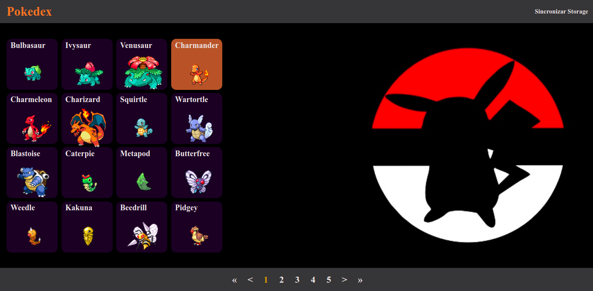
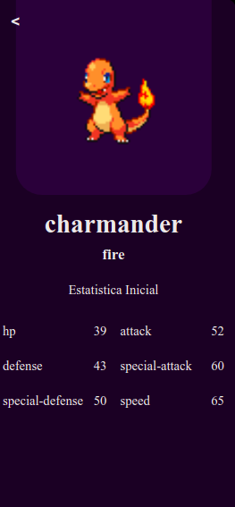

# Pokédex

## Desafio montar uma Pokédex

### Requisitos

1. HTML
2. SASS/CSS
3. JS

### Regras de Negócios

- Devem ser carregados somente 16 Pokémon na tela inicial
- Botões para avançar e retroceder na listagem (16 em 16)
- Tela inicial deve exibir o nome e a imagem do Pokémon
- Ao clicar em um Pokémon, deve redirecionar para uma página, que irá exibir os detalhes do mesmo

### Repositório API

[https://pokeapi.co/](https://pokeapi.co/)
